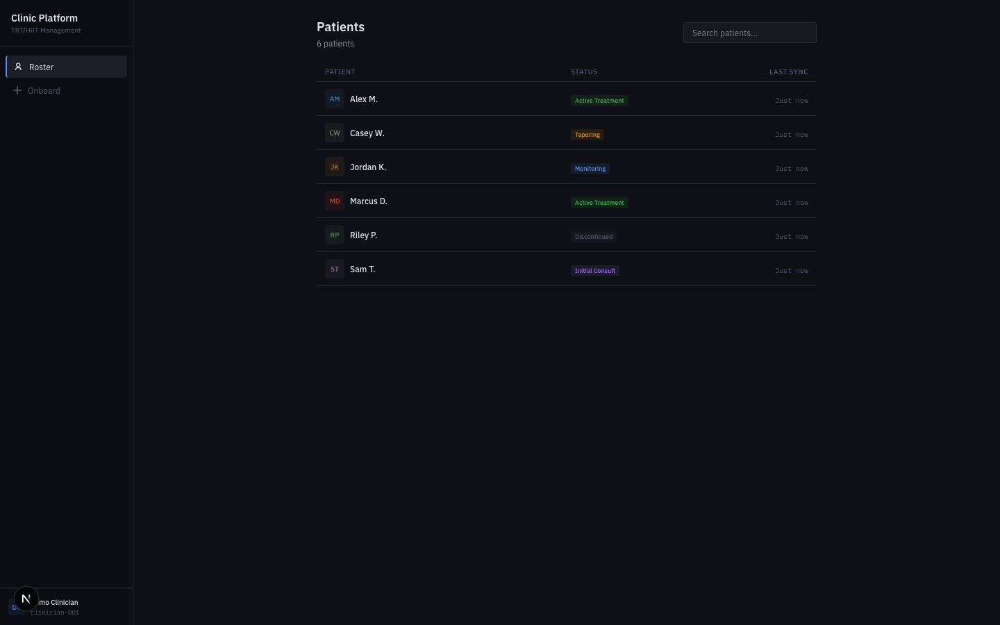
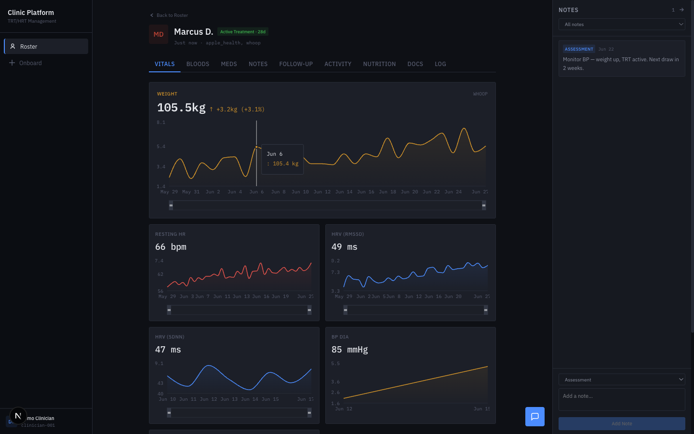
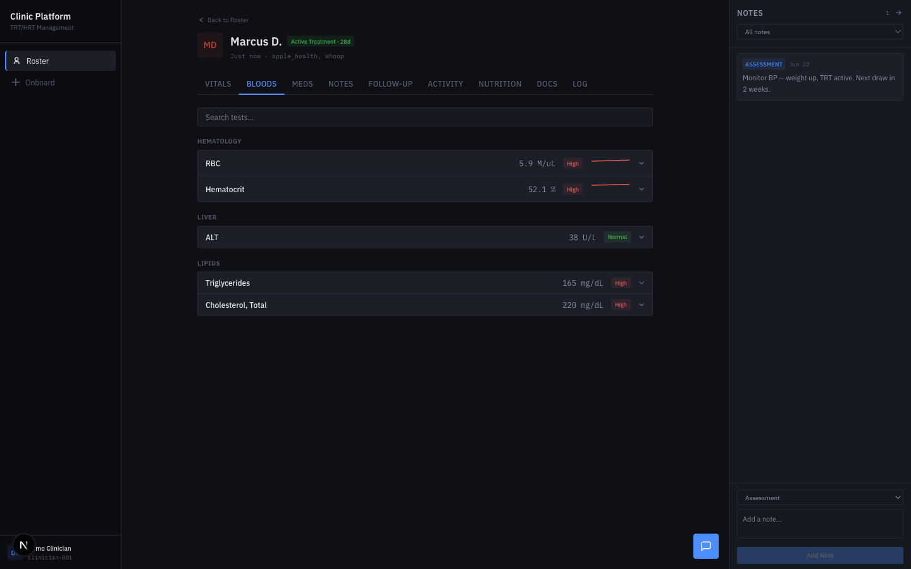
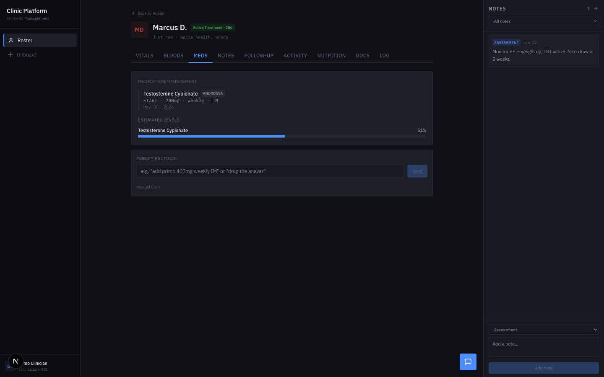
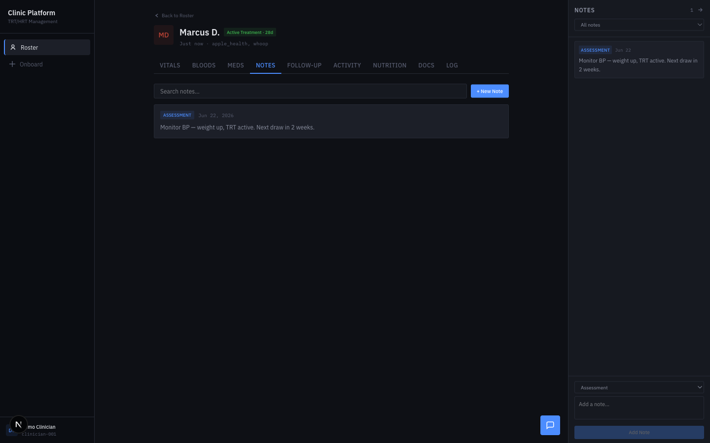
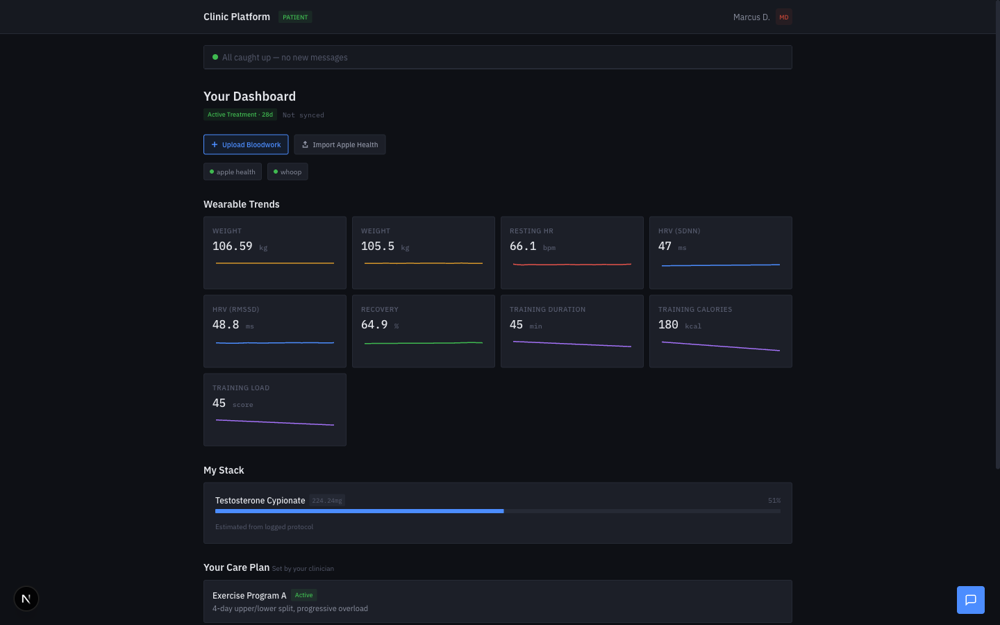
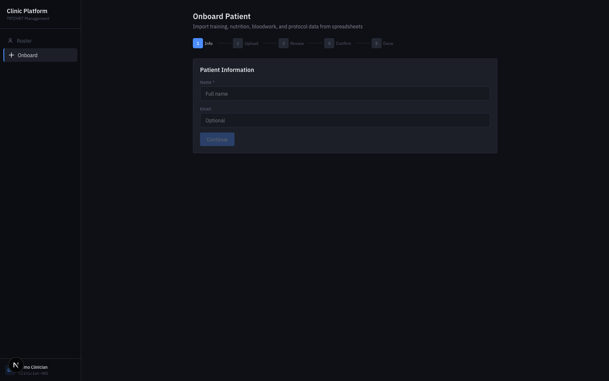

# Clinic Platform

A full-stack data consolidation system with pharmacokinetic modeling, streaming health data parsing, LLM-grounded tool-use chat, and an append-only typed operation audit layer. The domain is clinical patient management — the engineering is general-purpose.

**Next.js 16** · **FastAPI** · **SQLite** · **Claude API** · **TypeScript** · **Python**



---

## What's Interesting Here

### Pharmacokinetic Drug-Level Model

86 compounds modeled with ester-specific half-lives, steady-state detection, and day-by-day serum level estimation. Not a lookup table — actual PK math. Handles dose changes, compound stacking, and ester switching with proper level transitions. A user asks "what happens if I skip my injection?" and gets a real decay curve calculated from their logged protocol.

### Streaming XML Parser for Apple Health

Apple Health exports are 100MB+ XML files. The parser uses `iterparse` to stream-process records without loading the entire file into memory. Extracts 10 metric types + workout summaries, normalizes units (lbs→kg, count/min→bpm), validates plausibility ranges, and produces daily aggregates — single pass, constant memory.

### LLM Chat with Tool-Use Grounding

Multi-turn chat engine with 20+ tools. The LLM calls tools to query labs, vitals, drug levels, and compound history, then synthesizes responses grounded in actual data. Two role-scoped tool sets (clinician gets write tools, patient gets read-only + self-logging). Every response cites specific values from tool results — structured to prevent hallucination.

### Typed Operation Audit System

All write operations go through a closed enumerable set of typed operations. Each operation renders to human-readable text via a pure template function (no LLM-authored confirmations), logs to an append-only operation record, and triggers a notification to the affected user. Every mutation is deterministically auditable.

### AI-Powered Data Import

Excel/CSV upload with LLM-powered column mapping. Claude Haiku analyzes headers + sample rows, proposes a mapping to the database schema, identifies ambiguous columns, and flags conflicts for human review before import executes.

---

## Feature Walkthrough

### Clinician Side

**Vitals** — Weight, resting HR, HRV (RMSSD + SDNN), blood pressure. Interactive area charts with draggable brush sliders for date range narrowing.



**Bloodwork** — Lab results grouped by category, flag badges (high/low/normal), expandable metric rows with full charts, reference range overlays, and historical data tables. Search filters across all tests.



**Medications** — Compound timeline with PK-modeled estimated levels. Natural language prescribing ("add anastrozole 0.5mg twice weekly") or manual form. Estimated serum levels from the pharmacokinetic model.



**Clinical Notes** — SOAP-style types (Assessment, Plan, Subjective, Objective, Follow-up, General). Searchable, date-stamped. Side panel for quick entry, dedicated tab for full documentation.



### Patient Side

**Dashboard** — Wearable trends (Apple Health data), PK-estimated drug levels, clinician-set care plan, compound self-logging, notification queue for clinician actions.



**Onboarding** — Multi-step wizard for importing patient data from spreadsheets with AI column mapping.



---

## Architecture

```
Next.js 16 Frontend (React 19, TypeScript, Tailwind CSS 4)
    │
    │  REST API (40+ endpoints)
    ▼
FastAPI Backend (Python 3.11+)
    │
    ├── SQLite (WAL mode, 30+ tables)
    ├── Claude API (tool-use chat, Vision PDF extraction, structured data parsing)
    ├── PK Model (86 compounds, day-by-day pharmacokinetic estimates)
    ├── Apple Health Parser (streaming iterparse, 10 metric types)
    ├── Extraction Pipeline (PDF → LOINC normalization → validation)
    └── Compound Database (86 compounds with half-lives, dose ranges, monitoring markers)
```

---

## Tech Stack

| Layer | Technology |
|-------|-----------|
| Frontend | Next.js 16, React 19, TypeScript, Tailwind CSS 4, Recharts, Framer Motion |
| Backend | Python, FastAPI, Pydantic, SQLite (WAL mode) |
| AI/LLM | Claude API — multi-turn tool-use chat, Vision PDF extraction, structured data parsing |
| Data | 30+ table schema, LOINC-normalized lab data, Apple Health XML streaming, PK modeling |

---

## Project Structure

```
├── .frontend/src/
│   ├── app/
│   │   ├── clinician/       # Roster, patient detail (9 tabs), onboarding wizard
│   │   └── patient/         # Patient dashboard, self-logging
│   ├── components/          # 15 shared components (charts, forms, panels)
│   └── lib/                 # Types, API client, formatters
├── .src/clinic/
│   ├── api.py               # 40+ REST endpoints, role-scoped access
│   ├── chat.py              # LLM engine, tool dispatch, role-scoped tool sets
│   ├── pk_model.py          # Pharmacokinetic level estimation
│   ├── compound_db.py       # 86 compounds with PK parameters
│   ├── apple_health.py      # Streaming XML parser (iterparse)
│   ├── extraction/          # PDF → LOINC pipeline (extractor, validator, schema)
│   ├── llm/                 # 20+ tool definitions, context builders
│   ├── database.py          # SQLite schema (30+ tables)
│   ├── operations.py        # Typed operation set with deterministic rendering
│   └── onboarding.py        # LLM-powered spreadsheet import
└── docs/screenshots/
```

---

**Dhruv Singh** · University of Washington, Computer Science
